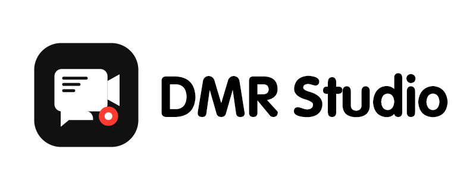

# DMR Studio —— 一个录制带弹幕直播的桌面管理工具

  

  面向新手用户的 录制带弹幕直播流 桌面管理工具。 
  更少配置门槛，更直观的界面，更接近日常软件的安装和使用体验。

  
  
  
  

## 产品定位

`DMR Studio` 是一款录制主播直播间的程序。

它的目标不是让用户研究复杂配置，而是尽量把录制、渲染、上传、任务管理和常用设置整理成更容易上手的桌面流程，让新手也能更顺畅地开始使用。

我们更重视这些体验：

- 新手第一次接触时也能尽快看懂界面
- 常见操作尽量通过按钮和表单完成
- 安装、启动、使用流程尽量接近日常 Windows 软件
- 后续版本持续增加功能，并长期维护更新

## 主要功能

- 录制任务管理  
  可以在桌面端集中管理录制任务，减少来回切换和分散操作。

- 常用设置集中整理  
  把日常会动到的设置统一放到桌面控制台里，使用上更直观，也更适合长期挂着跑。

- 托盘常驻与快捷操作  
  程序启动后可通过托盘快速打开主界面、进入常用功能、执行检查更新等操作。

- 更适合 Windows 用户的交付方式  
  直接提供安装包、桌面图标、开始菜单和卸载入口，不需要额外折腾运行环境。

- 升级与重装时尽量保留已有数据  
  新版本安装时会尽量复用原安装路径，并保留本地配置、登录信息和任务数据。

- 卸载时可自行决定是否清理配置  
  卸载程序时可以选择只移除程序本体，也可以连同本地配置一起清理；录制输出文件不会被自动删除。

## 当前这一版重点

当前版本为测试版 `0.1.0-dev`，这一版主要在整理桌面端基础体验：

- 把常用功能收进桌面控制台里。
- 调整设置入口和桌面端交互方式。
- 补齐托盘、桌面图标、开始菜单、卸载入口这些桌面应用该有的部分。
- 处理安装、覆盖升级、配置保留和卸载清理这些基础流程。

## 安装

目前通过 [Releases](https://github.com/jiabenguiyin/DMRStudio/releases) 页面下载安装包即可，安装完成后可以从桌面快捷方式、开始菜单或托盘入口启动。

## 更新计划

这是一个长期维护的产品，后续版本会继续加入更多功能，并持续优化操作体验。

后续更新方向包括但不限于：

- 更完整的任务配置体验
- 更稳定的运行与状态反馈
- 更顺畅的更新提示与安装包分发
- 更多适合日常使用的新功能

## 说明

- 当前阶段还是测试版本，重点是把桌面端体验和基础流程先打磨稳定。
- 如果遇到问题，欢迎通过 [Issues](https://github.com/jiabenguiyin/DMRStudio/issues) 反馈。
- 反馈时如果能附上复现步骤、系统环境和截图/录屏，会更方便定位。
